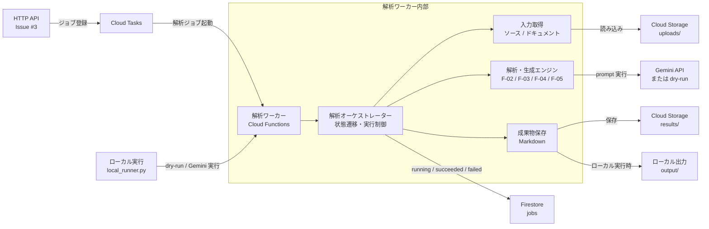

# 解析ワーカー

Issue #4 用の Cloud Functions バックグラウンドワーカーです。

Issue #2 のインフラ構成や Issue #3 の HTTP API 実装と後から接続しやすいように、
ワーカー内部は小さな境界に分けています。

- `main.py`: Cloud Tasks から起動される Cloud Functions HTTP エントリポイント
- `analysis_worker/payload.py`: Cloud Tasks payload の検証と正規化
- `analysis_worker/repositories.py`: Firestore のジョブ状態管理境界
- `analysis_worker/storage.py`: 入力参照と成果物保存の境界
- `analysis_worker/orchestrator.py`: ジョブ状態遷移と解析フェーズ実行制御
- `analysis_worker/engines.py`: F-02/F-03/F-04/F-05 の解析・生成フェーズ境界

## システム構成図



## 暫定タスク Payload

HTTP API 側がまだ構築途中のため、ワーカーは `snake_case` と `camelCase` の両方を受け付けます。

```json
{
  "jobId": "job-123",
  "projectName": "Legacy SaaS",
  "sourceArchiveUri": "gs://phoenix-uploads/uploads/job-123/source.zip",
  "documentUris": [
    "gs://phoenix-uploads/uploads/job-123/docs/spec.pdf"
  ],
  "resultsPrefix": "results/job-123"
}
```

`documents` にはオブジェクト形式も指定できます。

```json
{
  "bucket": "phoenix-uploads",
  "object": "uploads/job-123/docs/spec.pdf"
}
```

## ローカル確認

```bash
# 単体テスト実行
PYTHONPATH=apps/analysis-worker python3 -m unittest discover apps/analysis-worker/tests
# コンパイル
PYTHONPYCACHEPREFIX=/private/tmp/phoenixdevops-pycache python3 -m compileall apps/analysis-worker
```

## ローカル実行

- GCP の Firestore / Cloud Storage / Cloud Tasks を使わず、ローカルファイルでワーカーを通し実行できます。
- `--dry-run` を付けると Gemini API は呼び出さず、prompt 経路と成果物生成だけを確認します。

- ローカル実行では、入力ソースやドキュメントは別の場所へコピー・保管しません。
- `--source` で指定したディレクトリまたは ZIP、`--document` で指定したファイルをその場で読み取り、読み取ったテキストをメモリ上の `InputBundle` として解析・生成エンジンへ渡します。
- ローカル実行でファイルとして保存されるのは生成成果物だけです。

- 本番では入力ファイルは Cloud Storage の `uploads/` に保管され、成果物は `results/` に保存されます。
- 一方、ローカル実行では入力は指定元ファイルを直接参照し、成果物だけを `output/{job_id}/` に保存します。

```bash
INPUT_DIR="/Users/P767-2513/Documents/案件/PhoenixDevOps-docs/input"

PYTHONPATH=apps/analysis-worker python3 -m analysis_worker.local_runner \
  --source "$INPUT_DIR/CustomerServiceManagement.zip" \
  --document "$INPUT_DIR/カスタマーサポート管理SaaS (CustomerServiceManagement) アーキテクチャ設計書.pdf" \
  --project-name CustomerServiceManagement \
  --job-id customer-service-management-local \
  --dry-run
```

出力先は `output/customer-service-management-local/` です。

Gemini API を実際に呼び出す場合は、`GEMINI_API_KEY` を設定して `--dry-run` を外します。
モデル名は必要に応じて `GEMINI_MODEL` で変更できます。

```bash
INPUT_DIR="/Users/P767-2513/Documents/案件/PhoenixDevOps-docs/input"

GEMINI_API_KEY=... \
PYTHONPATH=apps/analysis-worker python3 -m analysis_worker.local_runner \
  --source "$INPUT_DIR/CustomerServiceManagement.zip" \
  --document "$INPUT_DIR/カスタマーサポート管理SaaS (CustomerServiceManagement) アーキテクチャ設計書.pdf" \
  --project-name CustomerServiceManagement \
  --job-id customer-service-management-gemini-local
```

現時点では PDF 本文抽出は本実装前です。
また、ZIP 内の暗号化されているファイルや UTF-8 として読めないファイルは、ローカル実行時にスキップします。

## デプロイ例

```bash
gcloud functions deploy analysis-worker \
  --gen2 \
  --runtime python312 \
  --region asia-northeast1 \
  --source apps/analysis-worker \
  --entry-point run_analysis_worker \
  --trigger-http \
  --set-env-vars FIRESTORE_JOBS_COLLECTION=jobs,RESULTS_PREFIX_TEMPLATE=results/{job_id}
```

現時点では Gemini prompt と呼び出し口までの仮実装です。
`GEMINI_API_KEY` がない場合、または `--dry-run` / `GEMINI_DRY_RUN=true` の場合は dry-run 応答で成果物を生成します。
ZIP 展開、PDF/Excel の本格抽出、差分分類の精度改善は次の実装単位で進めます。
