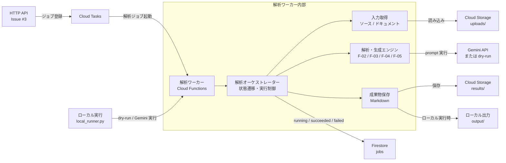

# 解析ワーカー

Issue #4 用の Cloud Functions バックグラウンドワーカーです。

Issue #2 のインフラ構成や Issue #3 の HTTP API 実装と後から接続しやすいように、
ワーカー内部は小さな境界に分けています。

- `main.py`: Cloud Tasks から起動される Cloud Functions HTTP エントリポイント
- `analysis_worker/payload.py`: Cloud Tasks payload の検証と正規化
- `analysis_worker/repositories.py`: Firestore のジョブ状態管理境界
- `analysis_worker/storage.py`: Cloud Storage/ローカル入力読み込みと成果物保存の境界
- `analysis_worker/orchestrator.py`: ジョブ状態遷移と解析フェーズ実行制御
- `analysis_worker/engines.py`: F-02/F-03/F-04/F-05 の解析・生成フェーズ境界

## システム構成図



## 暫定タスク Payload

HTTP API 側がまだ構築途中のため、ワーカーは `snake_case` と `camelCase` の両方を受け付けます。

```json
{
  "jobId": "job-123",
  "projectName": "Legacy SaaS",
  "sourceArchiveUri": "gs://phoenix-uploads/uploads/job-123/source.zip",
  "documentUris": [
    "gs://phoenix-uploads/uploads/job-123/docs/spec.pdf"
  ],
  "resultsPrefix": "results/job-123"
}
```

`documents` にはオブジェクト形式も指定できます。

```json
{
  "bucket": "phoenix-uploads",
  "object": "uploads/job-123/docs/spec.pdf"
}
```

## ローカル確認

```bash
# 単体テスト実行
PYTHONPATH=apps/analysis-worker python3 -m unittest discover apps/analysis-worker/tests
# コンパイル
PYTHONPYCACHEPREFIX=/private/tmp/phoenixdevops-pycache python3 -m compileall apps/analysis-worker
```

## ローカル実行

ローカル環境で解析ワーカーを実行し、Gemini API（または dry-run）による成果物生成を確認できます。

### 1. 前提条件

- **Python環境**: Python 3.10以上
- **依存ライブラリ**: `pip install -r requirements.txt` でインストール済みであること
- **APIキー**: Gemini APIを使用する場合、`GEMINI_API_KEY` が必要

### 2. 設定項目

#### 環境変数
| 変数名 | 必須 | 説明 |
| :--- | :--- | :--- |
| `GEMINI_API_KEY` | 任意(*) | Gemini APIのキー。dry-run時は不要。 |
| `GEMINI_MODEL` | 任意 | 使用するモデル。デフォルト: `gemini-2.0-flash` |
| `GEMINI_DRY_RUN` | 任意 | `true`に設定すると、APIを呼び出さずダミー応答を返します。 |

(*) `--dry-run` 引数を付けない場合は必須。

#### 実行引数 (`local_runner.py`)
| 引数 | 必須 | 説明 |
| :--- | :--- | :--- |
| `--source` | **はい** | 解析対象のソース（ZIPファイルまたはディレクトリ） |
| `--document` | **はい** | 比較対象のドキュメント。複数指定可能。 |
| `--project-name`| いいえ | プロジェクト名（レポート内に反映されます） |
| `--job-id` | いいえ | 実行ID。出力先フォルダ名 `output/{job_id}/` に使用されます。 |
| `--dry-run` | いいえ | APIを呼び出さずに実行する場合に指定します。 |

### 3. 実行例

`INPUT_DIR` という変数に入力ファイルのディレクトリを代入して実行する例です。

```bash
# 1. 入力ディレクトリとAPIキーの設定
export INPUT_DIR="/path/to/your/input"
export GEMINI_API_KEY="your-api-key-here"

# 2. 解析の実行
PYTHONPATH=apps/analysis-worker python3 -m analysis_worker.local_runner \
  --source "$INPUT_DIR/CustomerServiceManagement.zip" \
  --document "$INPUT_DIR/architecture_design.pdf" \
  --project-name "MyProject" \
  --job-id "local-test-01"
```

- **出力先**: `output/local-test-01/` にレポートが生成されます。
- **動作確認のみ**: APIを消費したくない場合は、コマンド末尾に `--dry-run` を追加してください。

---

## 開発・テスト

```bash
gcloud functions deploy analysis-worker \
  --gen2 \
  --runtime python312 \
  --region asia-northeast1 \
  --source apps/analysis-worker \
  --entry-point run_analysis_worker \
  --trigger-http \
  --set-env-vars FIRESTORE_JOBS_COLLECTION=jobs,RESULTS_PREFIX_TEMPLATE=results/{job_id}
```

現時点では Gemini prompt と呼び出し口、入力本文取得、軽量な事前構造解析までの実装です。
`GEMINI_API_KEY` がない場合、または `--dry-run` / `GEMINI_DRY_RUN=true` の場合は dry-run 応答で成果物を生成します。
PDF/Excel の抽出精度改善、差分分類の精度改善は次の実装単位で進めます。
