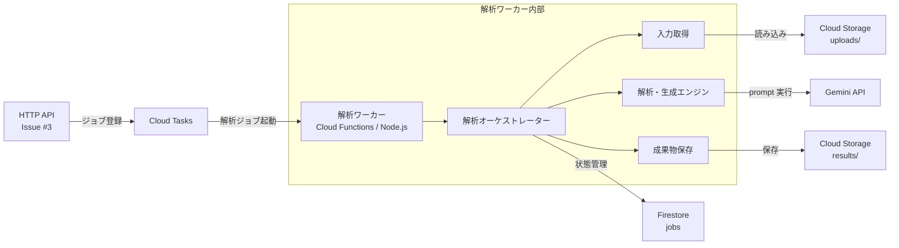

# 解析ワーカー

Issue #4 用の Cloud Functions バックグラウンドワーカーです。Cloud Tasks から HTTP で起動され、Cloud Storage から入力を読み込み、Firestore のジョブ状態を更新し、Gemini API で成果物を生成します。

## 構成

- `src/index.js`: Cloud Functions HTTP エントリポイント `runAnalysisWorker`
- `src/payload.js`: Cloud Tasks payload の検証と正規化
- `src/repositories.js`: Firestore のジョブ状態管理境界
- `src/storage.js`: Cloud Storage/ローカル入力読み込みと成果物保存の境界
- `src/orchestrator.js`: ジョブ状態遷移と解析フェーズ実行制御
- `src/engines.js`: F-02/F-03/F-04/F-05 の解析・生成フェーズ境界
- `src/prompts.js`: Gemini に渡す prompt 生成
- `src/local-runner.js`: ローカル実行用 CLI

## システム構成



## タスク Payload

HTTP API 側との接続を容易にするため、`snake_case` と `camelCase` の両方を受け付けます。

```json
{
  "jobId": "job-123",
  "projectName": "Legacy SaaS",
  "sourceArchiveUri": "gs://phoenix-uploads/uploads/job-123/source.zip",
  "documentUris": [
    "gs://phoenix-uploads/uploads/job-123/docs/spec.pdf"
  ],
  "resultsPrefix": "results/job-123"
}
```

`documents` にはオブジェクト形式も指定できます。

```json
{
  "bucket": "phoenix-uploads",
  "object": "uploads/job-123/docs/spec.pdf"
}
```

## ローカル確認

Node.js はリポジトリ root の `.node-version` に合わせて 24 系を使用します。

```bash
cd apps/analysis-worker
npm test
```

## ローカル実行

依存関係をインストールすると、Functions Framework や Gemini / Google Cloud SDK を含めたローカル実行ができます。dry-run では `GEMINI_API_KEY` は不要です。

```bash
cd apps/analysis-worker
npm install

node src/local-runner.js \
  --source "/path/to/input/CustomerServiceManagement.zip" \
  --document "/path/to/input/architecture_design.pdf" \
  --project-name "MyProject" \
  --job-id "local-test-01" \
  --dry-run
```

出力先はデフォルトで `output/{job_id}/` です。変更する場合は `--output` を指定してください。

## 環境変数

| 変数名 | 必須 | 説明 |
| --- | --- | --- |
| `GEMINI_API_KEY` | 任意 | Gemini API のキー。dry-run または未設定時は dry-run client を使用します。 |
| `GEMINI_MODEL` | 任意 | 使用するモデル。デフォルト: `gemini-2.0-flash` |
| `GEMINI_DRY_RUN` | 任意 | `true` / `1` / `yes` で Gemini API を呼び出しません。 |
| `FIRESTORE_JOBS_COLLECTION` | 任意 | ジョブ状態を保存する Firestore コレクション。デフォルト: `jobs` |
| `RESULTS_BUCKET` | 任意 | 成果物保存先 bucket。未指定時は source archive と同じ bucket を使います。 |
| `RESULTS_PREFIX_TEMPLATE` | 任意 | 成果物 prefix。デフォルト: `results/{job_id}` |

## Cloud Functions デプロイ例

```bash
gcloud functions deploy analysis-worker \
  --gen2 \
  --runtime nodejs24 \
  --region asia-northeast1 \
  --source apps/analysis-worker \
  --entry-point runAnalysisWorker \
  --trigger-http \
  --set-env-vars FIRESTORE_JOBS_COLLECTION=jobs,RESULTS_PREFIX_TEMPLATE=results/{job_id}
```

現時点では Gemini prompt と呼び出し口、入力本文取得、軽量な事前構造解析までの実装です。PDF は `pdf-parse`、Excel は xlsx 内 XML の軽量抽出、ZIP は標準ライブラリベースの読み取りで扱います。
