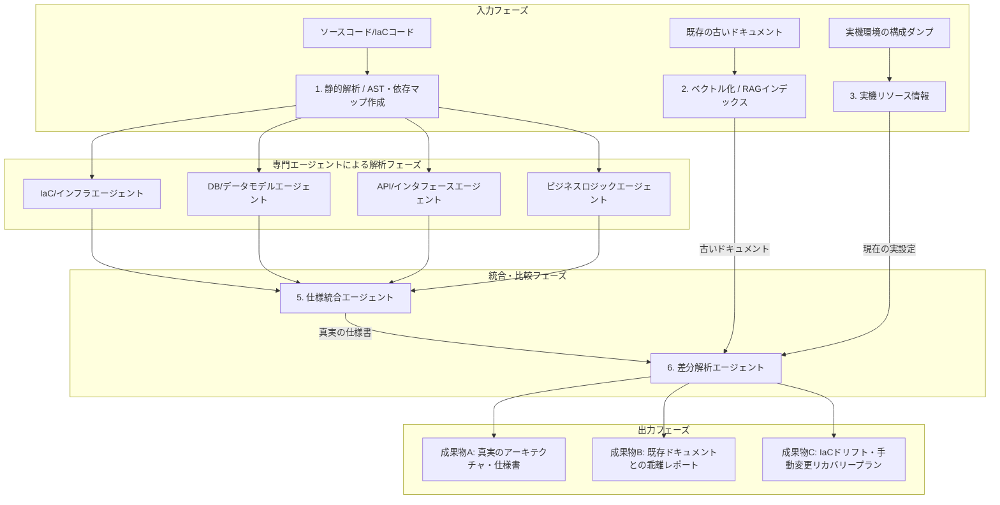

# AIエージェントによるコード解析＆仕様復旧ロードマップ

本ドキュメントは、前任者や他社から引き継いだ「ドキュメントと実態が乖離し、手動変更でIaCが崩壊したSaaSシステム」を対象に、AIエージェントを活用して「ソースコードを正とする真実の仕様書」を構築し、「既存ドキュメント・実環境との差分」を自動抽出するための実践的な手順とシステム設計をまとめたものです。

---

## 1. なぜ「そのままLLMに投入」すると失敗するのか？

LLMにソースコードをまとめて渡すと、以下の理由で失敗します。

1. **コンテキストウインドウと迷子問題（Lost in the Middle）** : 数万〜数十万行のコードを流し込むと、LLMは全体的なアーキテクチャと個別のロジックの接続を処理しきれず、適当な要約でお茶を濁します。
2. **抽象度のミスマッチ**: 「APIのシグネチャ」というミクロな視点と、「システム全体のデータフロー」というマクロな視点が混ざり合い、焦点のボケたドキュメントになります。
3. **静的解析ツールとの協調不足**: コードの依存関係（どの関数がどこを呼んでいるか）をLLMのテキスト推論だけに頼ると、ハルシネーション（嘘）が発生します。

これを克服するために、**「静的解析（コードのインデックス化） ＋ 専門分野別エージェント（分割統治） ＋ 合成エージェント（要約と統合）」の3レイヤー**でアプローチします。

---

## 2. 全体アーキテクチャ（マルチエージェント構成）

AIエージェント群がどのように連携して「真実の仕様書」と「差分レポート」を作るかの全体図です。



---

## 3. 解析・復旧の5つのステップ

### STEP 1: コードベースの構造化とマップ作成（静的解析の併用）
LLMに解析させる前に、ソースコードの「地図」を自動作成し、LLMが迷子にならないための道標を作ります。
1. **ディレクトリ構造とファイルのメタデータ抽出:**
    - ディレクトリツリーを生成します。
    - `package.json`, `go.mod`, `requirements.txt` などの依存関係ファイルをスキャンし、使用しているライブラリとバージョンを特定します。
2. **依存関係のグラフ化:**
    - 静的解析ツールを使い、ファイル・モジュール間の依存関係を Mermaid 形式などで出力します。
3. **IaCコードの静的ダンプ:**
    - Terraform コード等がある場合は、プロバイダやモジュール構造をリスト化します。

### STEP 2: 役割特化型「サブエージェント」による個別解析
コンテキストを小さく絞り、4つの専門エージェントにコードを分割して解析させます。各エージェントはLLMを使用し、構造化データ（MarkdownまたはJSON）を出力します。

1. **インフラ・IaCエージェント (Issue #31)**
   - **インプット:** `terraform/`, `CloudFormation/`, `/docker-compose.yml`, 各種Kubernetesマニフェストなど
   - **タスク:** クラウドリソース（VPC、ECS/EKS、RDS、ALB、S3など）の構成逆算、およびセキュリティグループ、IAMロール等のセキュリティ設計の抽出。
   - **成果物:** `infrastructure_spec.md` (インフラ物理/論理構成仕様)
2. **DB・データモデルエージェント (Issue #32)**
   - **インプット:** DBマイグレーションファイル、ORM定義（Prisma, TypeORM, SQLAlchemyなど）、DDLスクリプト
   - **タスク:** テーブル構造、リレーション、インデックス設計、外部キー制約、ユニーク制約のモデリング。
   - **成果物:** `database_schema_spec.md` (ER図、データディクショナリ)
3. **API・インターフェースエージェント (Issue #33)**
   - **インプット:** ルーティング定義ファイル、コントローラークラス、バリデーションロジック
   - **タスク:** 全APIエンドポイント（URL, メソッド, 認証要件）およびリクエストパラメータ、レスポンス形式のマッピング。
   - **成果物:** `api_specification.md` (API仕様書)
4. **ビジネスロジック・ユースケースエージェント (Issue #34)**
   - **インプット:** サービス層、ドメインモデル、ユースケースのコード
   - **タスク:** 主要なビジネスフローの言語化、状態遷移のトリガーと遷移先特定。
   - **成果物:** `business_logic_spec.md` (機能一覧、ユースケース仕様書)

### STEP 3: 真実の仕様書（Single Source of Truth）の合成 (Issue #35)
個別解析フェーズで得られた4つの仕様書ファイルを統合し、システム全体の「真実の仕様書」を作成します。
* **統合エージェント（Synthesis Agent）の役割:**
  - 4つの構成要素（インフラ、DB、API、ビジネスロジック）を接着し、コンポーネント間のデータフローを解説。
  - システム全体の概要（Mermaidによるシステムコンポーネント図、データフロー図）を生成。
  - **成果物:** `single-source-of-truth.md` (システム全体SSOT仕様書)

### STEP 4: 既存ドキュメントおよび「実機環境」との差分分析（ギャップ分析） (Issue #36)
仕様書が完成後、「現実の崩壊箇所」を特定するための比較プロセスを実行します。
```
【入力1】コードから生成した「真実の仕様書」
                 VS
【入力2】古い既存ドキュメント
                 VS
【入力3】現在のクラウド実機環境の設定 (ドリフト検出)
```
1. **対・既存ドキュメント（ドキュメントの乖離抽出）:**
   - 「コードから作った仕様書」と「古いドキュメント」を比較させ、以下の3分類で乖離レポートを出力。
     - **【廃止済み（Deprecated）】**: 古いドキュメントに記載があるが、コード上は既に削除・変更されている機能。
     - **【ドキュメント未記載（Missing）】**: コードには実装されているが、古いドキュメントに一切記載がない機能。
     - **【ロジック不整合（Mismatch）】**: 記載はあるが、実際の挙動やデータ定義が大きく異なっている部分。
2. **対・実機環境（IaC崩壊の特定）:**
   - 「Git上のIaCコード（Terraform等）」と「実機設定ダンプ」を比較し、手動変更（ドリフト）された箇所を特定。

### STEP 5: 回復アクションプランの策定 (Issue #37)
分析された差分をもとに、AIエージェントに「引き継ぎシステムをクリーンな状態に戻すためのタスクリスト（ロードマップ）」を生成させます。
* **回復エージェント（Recovery Agent）のタスク:**
  - ドリフトが発生しているIaCコードの修復コード（修正用Terraformコード等）の提示。
  - デッドコードの削除候補リストの提示。
  - バグや脆弱性の修正優先度付きバックログの作成。

---

## 4. エージェント用プロンプト・設計テンプレート

エージェントを動かす際のシステムプロンプトの設計例です。

### 例①：API仕様抽出エージェント用プロンプト
```
# 役割
あなたは高度なソフトウェアアーキテクトです。提供された「Webアプリケーションのコントローラー/ルーティングに関連するソースコード」を注意深く読み込み、APIのインターフェース仕様を客観的な「事実（ファクト）」のみに基づいて抽出してください。

# 制約事項
- 推測は一切排除してください。コードに書かれていない挙動は、推測せず「不明・コード上未確認」と明記してください。
- 出力はMarkdown形式、かつSwagger/OpenAPI 3.0に変換しやすい構造にしてください。

# 抽出項目
1. エンドポイント（パス、HTTPメソッド）
2. 要求される認証情報（Header, Token, Cookie等）
3. リクエストパラメータ（Query, Path, Body、それぞれの型とバリデーションルール）
4. レスポンス（正常系・異常系のHTTPステータスコード、JSON構造）
5. このAPIが呼び出すサービス/ドメインロジック（ファイル名、メソッド名、依存関係）
```

### 例②：差分解析（Gap Analysis）エージェント用プロンプト
```
# 役割
あなたはシステム監査のスペシャリストです。
「ソースコードから解析された最新の仕様（真実）」と「過去に作成された既存の設計書（古いドキュメント）」、および「実機から取得した設定（実機構成）」の3つを比較し、システム情報の不整合をすべて洗い出してください。

# インプット
- [INPUT A]: コード解析仕様書（真実）
- [INPUT B]: 既存の古い設計書（期待値）
- [INPUT C]: クラウド実機ダンプ（現在の物理構成）

# 出力フォーマット
以下の3つのセクションで、重要度（High/Medium/Low）を添えて報告書を作成してください。

## 1. ドキュメントの嘘と抜け漏れ（INPUT A vs INPUT B）
- 【重大度】【場所】乖離している仕様の詳細
- 理由（コード上どうなっているか、ドキュメント上どう書かれているか）

## 2. IaCの崩壊と手動ドリフト（INPUT A (Terraform等) vs INPUT C）
- 【重大度】【リソース名】手動変更が加えられているインフラリソース
- 差分内容（IaCコード上の記述 vs 実機の状態）

## 3. 推奨される修復アクション
- 代理作業優先順位付きのアクションプラン。
```

---

## 5. 本アプローチのメリット

1. **ブラックボックスの解明:** コードという「嘘をつかない真実」から仕様書を作るため、古いドキュメントに惑わされなくなります。
2. **手動変更の可視化:** クラウドのコンソール画面（Web UI）から何が勝手に変更されたかが一目瞭然になり、IaCの健全性を取り戻せます。
3. **安全な運用再開:** バグやエラーハンドリングの欠落、放置されたデッドコードの存在が解析段階で可視化されるため、根本的なリファクタリング計画が立てられます。
