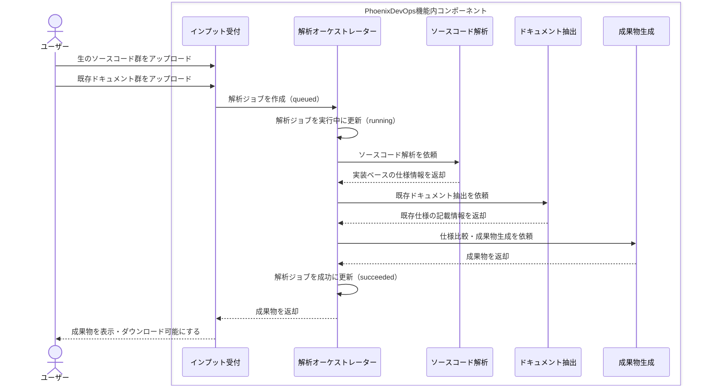
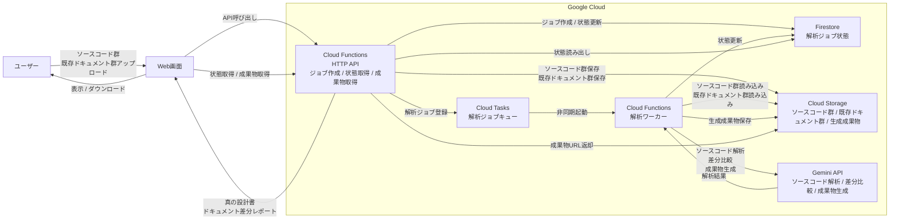

# 「ドキュメント・ドリフト」検知＆真実の設計書生成エージェント 機能仕様書

## 1. この機能で解決すること

この機能は、古いドキュメントと現在のソースコードが一致していないシステムを対象に、現行仕様を短時間で把握できる状態を作る。

基本方針は次のとおり。

- ソースコードを「正」として扱う。
- 既存ドキュメントは、比較対象および補助情報として扱う。
- 根拠を示せない内容は断定しない。
- 解析できない箇所は「判断不能」として明示する。

MVPでは、ユーザーがGit管理されていない生のソースコード群と、既存の古いドキュメント群を登録すると、次の2つを生成する。

- 真の設計書: 現在の実装を反映した仕様書
- ドキュメント差分レポート: 既存ドキュメントとソースコードの差分をまとめたレポート

## 2. MVPで作る範囲

### 2.1. 対象機能

MVPでは、次の6機能を作る。

| ID | 機能 | MVPでやること |
| --- | --- | --- |
| F-01 | 解析対象登録 | Git管理されていない生のソースコード群と、既存ドキュメント群を受け付ける |
| F-02 | ソースコード解析 | ファイル構成、設定、ルーティング、API、DB定義、依存関係、READMEを解析する |
| F-03 | ドキュメント抽出 | PDF、Excelを中心とした既存ドキュメント群から仕様記述を抽出する |
| F-04 | 真の設計書生成 | ソースコード由来の情報を正として、Markdown形式の設計書を生成する |
| F-05 | ドキュメント差分レポート生成 | 実装と既存ドキュメントの差分を4分類で整理し、Markdown形式で出力する |
| F-06 | 解析ジョブ管理 | `queued / running / succeeded / failed` の状態を管理する |

`apps/analysis-worker` の現行実装では、F-02〜F-05 は軽量な事前抽出結果を Gemini API の prompt に渡して Markdown を生成する。F-06 は Cloud Tasks から HTTP POST で起動される Cloud Functions ワーカーとして実装する。

### 2.2. MVPではやらないこと

次の機能は、MVP対象外とする。

| 対象外 | 理由・対応方針 |
| --- | --- |
| GitHubリポジトリ連携 | MVPではアップロードされた生のソースコード群を入力とする |
| Google Drive連携 | MVPでは通常のファイルアップロードで代替する |
| スキャン文書OCR | MVPではテキスト抽出可能な文書のみ扱う |
| 言語固有の深い静的解析 | MVPでは汎用的な構造解析に留める |
| IaC生成・STG環境構築 | 本エージェントの将来拡張として扱う |
| 仕様質問AIチャット | 生成成果物の活用機能としてv2以降で扱う |

## 3. ユーザーの流れ

1. ユーザーがGit管理されていない生のソースコード群をアップロードする。
2. ユーザーが古い仕様書や設計書などの既存ドキュメント群をアップロードする。
3. システムが解析ジョブを作成し、解析を開始する。
4. ソースコードから現行仕様を抽出する。
5. 既存ドキュメント群から記載内容を抽出する。
6. ソースコード由来の仕様を正として、真の設計書を生成する。
7. ソースコード由来の仕様と既存ドキュメント群を比較し、ドキュメント差分レポートを生成する。
8. ユーザーが生成結果を画面で確認し、Markdownとしてダウンロードする。

## 4. 入力仕様

| 入力 | 必須 | 内容 |
| --- | --- | --- |
| ソースコード群 | 必須 | Git管理されていない生のソースコード一式。MVPではZIPファイルでのアップロードを主想定とする。現行ワーカーはZIP内のテキストファイル、または単体のテキストファイルを読み込める |
| 既存ドキュメント群 | 必須 | ソースコードと乖離している可能性がある古い仕様書・設計書。PDF、Excel、ZIP内テキスト、Markdown、プレーンテキストを読み込み対象とする |
| プロジェクト名 | 任意 | 生成される真の設計書、ドキュメント差分レポートのタイトルに使用する |

既存ドキュメント群が未登録の場合はドキュメント差分を評価できないため、MVPの通常フローでは必須入力として扱う。

Cloud Tasks から `apps/analysis-worker` に渡す payload は、HTTP API 側との接続容易性のため `snake_case` と `camelCase` の両方を受け付ける。

| 項目 | 必須 | 内容 |
| --- | --- | --- |
| `job_id` / `jobId` | 必須 | 解析ジョブID |
| `source_archive` / `sourceArchive` / `source_archive_uri` / `sourceArchiveUri` | 必須 | ソースコード群の `gs://bucket/object` URI、または `{ bucket, object }` 形式の参照 |
| `documents` / `document_uris` / `documentUris` | 必須 | 既存ドキュメント群の参照配列。空配列は不可 |
| `project_name` / `projectName` | 任意 | 成果物タイトル用のプロジェクト名 |
| `results_prefix` / `resultsPrefix` | 任意 | 成果物保存先 prefix。未指定時は `results/{job_id}` |
| `requested_by` / `requestedBy` | 任意 | 依頼者識別子。現行ワーカーでは payload として保持するが処理分岐には使わない |

## 5. 解析対象

| 項目 | MVPでの扱い |
| --- | --- |
| 対象システム | Webアプリケーションのソースコード一式を主な対象とする |
| 言語・フレームワーク | 限定しない。ただし言語固有の深い静的解析は保証しない |
| 解析根拠 | ファイル構成、設定ファイル、ルーティング、API定義、DB定義、依存関係、README、IaC（Terraform, AWS CDK等） |
| 解析対象外 | `node_modules`、`.git`、`.venv`、`__pycache__`、`dist`、`build`、`coverage`、`.next`、画像・動画などのバイナリファイル |
| 解析できない箇所 | 「判断不能」として成果物に出力する |

現行ワーカーは、入力本文の Gemini prompt への詰め込み過ぎを避けるため、ソースコード・ドキュメントともに最大80ファイル、1ファイルあたり最大12,000文字を上限に読み込む。上限を超える内容は切り詰めた上で解析対象に含める。
また、LLMに渡す前処理として、Cloud Functions 上で外部 CLI に依存しない軽量な静的構造マップを生成する。構造マップには、ディレクトリツリー、ファイルメタデータ、依存マニフェスト、JS/TS・Python・Go の import 依存候補、Terraform の provider/module/resource/data/variable/output 構造を含める。

## 6. 出力仕様

### 6.1. 真の設計書

ソースコードを正として、現在のシステムの実態を反映した設計書を生成する。

成果物ファイル名は `true-design.md` とする。

| 章 | 内容 |
| --- | --- |
| 1. 解析対象 | アップロードされたソースコード、既存ドキュメント、解析日時、解析対象ファイル、除外ファイル |
| 2. システム概要 | システムの目的、主な利用者、主要機能、推測事項 |
| 3. 技術スタック | フロントエンド、バックエンド、DB、インフラなどの推定結果と根拠 |
| 4. 主要機能一覧 | 機能名、概要、根拠コード、備考 |
| 5. 画面・ルーティング一覧 | パス、画面名、役割、根拠コード |
| 6. API一覧 | メソッド、パス、処理概要、入力、出力、根拠コード |
| 7. データモデル | モデル名、項目、型、制約、根拠コード |
| 8. 業務ルール・バリデーション | ルール、内容、根拠コード、確度 |
| 9. 外部連携 | 連携先、用途、根拠コード |
| 10. 判断不能・推測事項 | 判断できなかった項目、理由、必要な追加情報 |

### 6.2. ドキュメント差分レポート

ソースコード由来の仕様と既存ドキュメントを比較し、差分をレポート化する。

成果物ファイル名は `document-drift-report.md` とする。

#### 差分分類

| 分類 | 意味 |
| --- | --- |
| 実装あり・文書なし | ソースコード上には存在するが、既存ドキュメントに記載がない |
| 文書あり・実装なし | 既存ドキュメントに記載があるが、ソースコード上に確認できない |
| 内容不一致 | ソースコードと既存ドキュメントの内容が矛盾している |
| 判断不能 | 根拠不足、解析不能、または文書とコードの対応関係が特定できない |

#### レポート構成

| 章 | 内容 |
| --- | --- |
| 1. サマリー | 差分分類ごとの件数 |
| 2. 差分一覧 | ID、分類、対象、内容、重要度、確度、根拠コード、根拠ドキュメント、推奨対応 |
| 3. 分類定義 | 差分分類の説明 |
| 4. 判断ルール | ソースコードを正とすること、推測を断定しないこと、根拠を明示すること |

### 6.3. 解析補助成果物

STEP 1 の静的解析結果として、後続の専門エージェントがコード探索で迷子にならないための補助成果物を生成する。これらは画面表示を前提にせず、バックエンド成果物として保存する。

| 成果物ファイル名 | 内容 |
| --- | --- |
| `codebase-map.md` | ディレクトリツリー、ファイルメタデータ、依存リスト、API/DB候補のMarkdownダンプ |
| `module-dependencies.mmd` | モジュール間依存候補のMermaidグラフ |
| `iac-structure.md` | Terraform の provider/module/resource/data/variable/output 構造リスト |
| `codebase-map.json` | 後続エージェントが再利用しやすい構造化JSON |

## 7. 判断ルール

- 差分判定では、ソースコードを正とし、既存ドキュメントは補助情報として扱う。
- ソースコードと既存ドキュメントに矛盾がある場合は、矛盾箇所を列挙する。
- 根拠がない推測は「推測」と明示する。
- 根拠を示せない内容は断定しない。
- 部分的に解析できた場合は、生成可能な成果物を出力し、未解析箇所を「判断不能」として明示する。

## 8. 解析ジョブ管理

| 状態 | 意味 |
| --- | --- |
| queued | 解析ジョブが作成され、実行待ちの状態 |
| running | ソースコード解析、ドキュメント抽出、成果物生成のいずれかを実行している状態 |
| succeeded | 真の設計書、または真の設計書とドキュメント差分レポートの生成が完了した状態 |
| failed | 解析または成果物生成に失敗した状態 |

`failed` の場合は、失敗理由をユーザーに表示する。ユーザーは失敗したジョブを再実行できる。

`apps/analysis-worker` は Firestore の `jobs` コレクションを既定の状態保存先とし、状態更新時に `status`、`updated_at`、`artifact_paths`、`error_message` を保存する。既に `succeeded` のジョブが再実行された場合は、再解析せず保存済みの `artifact_paths` を返し、レスポンスに `job_already_succeeded` を含める。

Cloud Functions の HTTP レスポンスは次の方針とする。

| 条件 | ステータス | レスポンス概要 |
| --- | ---: | --- |
| `POST` 以外 | 405 | `method_not_allowed` |
| payload 不正 | 400 | `invalid_payload` と検証エラーメッセージ |
| 解析成功 | 200 | `jobId`、`status`、`artifactPaths` |
| 解析失敗 | 500 | `jobId`、`failed`、失敗メッセージ |

## 9. 処理構成

### 9.1. 登場要素

| 分類 | 要素 | 役割 |
| --- | --- | --- |
| 外部アクター | ユーザー | 解析対象を登録し、生成された成果物を確認する |
| 外部入力元 | アップロードファイル | ユーザーが登録する生のソースコード群と既存ドキュメント群 |
| 機能内コンポーネント | インプット受付 | ソースコード群と既存ドキュメント群を受け付け、解析ジョブを作成する |
| 機能内コンポーネント | 解析オーケストレーター | 解析ジョブの状態管理、各解析処理、成果物生成を制御する |
| 機能内コンポーネント | ソースコード解析 | ソースコードを正として、実装ベースの仕様を抽出する |
| 機能内コンポーネント | ドキュメント抽出 | 既存ドキュメントの記載内容を抽出する |
| 機能内コンポーネント | 成果物生成 | 真の設計書とドキュメント差分レポートを生成する |

### 9.2. 処理シーケンス

## 10. システム構成図

### 10.1. 想定技術スタック

| 分類 | 採用技術 | 用途 |
| --- | --- | --- |
| API実行基盤 | Cloud Functions | 解析ジョブ作成、状態取得、成果物取得APIの実行 |
| 非同期実行 | Cloud Tasks | 解析ジョブのキューイング、解析ワーカーの起動、リトライ制御 |
| ジョブ状態管理 | Firestore | `queued / running / succeeded / failed` の保存 |
| AI技術 | Gemini API | ソースコード解析、ドキュメント抽出、成果物生成 |
| ファイル保管 | Cloud Storage | アップロードされたソースコード群、既存ドキュメント群、生成成果物の保存 |

### 10.2. 採用背景

| 採用技術 | 採用理由 | 代替案と見送り理由 |
| --- | --- | --- |
| Cloud Functions | Web画面を別に用意し、バックエンドをAPIとして呼び出す前提のため。解析ジョブ作成、状態取得、成果物取得を小さなHTTP APIとして分けやすい。 | Cloud Runも選択肢だが、MVPではWebアプリ本体を載せる前提ではないため採用優先度を下げる。 |
| Cloud Tasks | ユーザー操作で作成された解析ジョブをキューに積み、解析ワーカーへ確実に渡したい。リトライ、実行量制御、HTTPワーカー起動を扱いやすい。 | Pub/Subはイベント配信や複数購読者への通知に向くが、今回の主目的はジョブキューのためCloud Tasksを優先する。 |
| Firestore | `queued / running / succeeded / failed` などのジョブ状態をAPIから読み書きしやすい。画面側から状態取得APIを呼ぶ構成と相性がよい。 | Cloud Storageに状態ファイルを置く方法も可能だが、状態更新や検索が増えると扱いづらい。 |
| Cloud Storage | アップロードされたソースコード群、既存ドキュメント群、生成された真の設計書・ドキュメント差分レポートを保管する用途に合う。 | Firestoreにファイル本文を保存する方法もあるが、大量のExcel/PDFや生成成果物の保存先としてはCloud Storageの方が自然。 |
| Gemini API | ハッカソン指定のGoogle AI技術群の中で、MVPの中心処理であるソースコード解析、既存ドキュメント抽出、仕様比較、Markdown成果物生成に最も直接使いやすい。 | Gemini Enterprise、Agent Builder、ADKなども選択肢だが、MVPではまず単一のAPIからAI処理を呼び出す方が構成をシンプルにできるため、Gemini APIを採用する。 |

## 11. `apps/analysis-worker` の現行実装

### 11.1. 実行方式

解析ワーカーは Node.js 24 系の TypeScript 実装で、Cloud Functions の HTTP エントリポイント `runAnalysisWorker` として動作する。Cloud Tasks から `POST` で起動され、Cloud Storage から入力を読み込み、Firestore のジョブ状態を更新し、Gemini API で成果物を生成して Cloud Storage に保存する。

ローカル確認用に `src/local-runner.ts` を持ち、`--source`、`--document`、`--project-name`、`--job-id`、`--output`、`--dry-run` を指定して同じオーケストレーターを実行できる。

### 11.2. 入力読み込み

| 入力種別 | 現行実装の扱い |
| --- | --- |
| ソースZIP | ZIP内のテキスト系ファイルを読み込む。除外ディレクトリと非テキスト拡張子は読み飛ばす |
| ソース単体ファイル | テキスト系拡張子のみ読み込む |
| PDF | `pdf-parse` で本文テキストを抽出する。抽出できない場合は抽出不可として扱う |
| Excel | xlsx 内 XML から shared strings と worksheet の値を軽量抽出する |
| ドキュメントZIP | ZIP内のテキスト系ファイルを読み込む |
| Markdown / プレーンテキスト等 | UTF-8 テキストとして読み込む |
| 未対応形式 | 未対応形式であることを示す本文を生成し、判断不能候補として扱う |

### 11.3. ソースコード事前解析

Gemini に渡す前に、ワーカー側で次の軽量な構造情報を抽出する。

| 観点 | 抽出内容 |
| --- | --- |
| ファイル構成 | 読み込み対象になったソースファイルパス一覧 |
| ディレクトリ構造 | ファイルパス一覧から生成する ASCII ツリー表示 |
| 設定ファイル | `.env`、`package.json`、`requirements.txt`、`pyproject.toml`、`go.mod`、`Gemfile`、YAML/TOML/properties/conf など |
| README | ファイル名が `README` で始まるファイル |
| 依存関係 | `package.json`、`requirements.txt`、`pyproject.toml`、`go.mod`、`Gemfile` から依存名とバージョン記述を抽出 |
| ルーティング/API候補 | FastAPI風デコレーター、Flask、Express、Django、Spring Mapping、Next.js API Routes の候補 |
| DB定義/データモデル候補 | SQL の `CREATE TABLE` / `ALTER TABLE` / `CREATE INDEX`、Django model、Prisma model |
| モジュール間依存グラフ | JS/TS/Python の相対パス `import` / `require` を解析し、Mermaid `graph TD` 形式で出力（最大50エッジ） |
| IaC構成要素 | 各種IaC（Terraform, AWS CDK, CloudFormation, Kubernetes等）ファイルを静的解析し、構成要素（Resource/Stack等）をMarkdownテーブルで出力 |

この事前解析は仕様確定ではなく、Gemini prompt に渡す根拠候補である。最終成果物ではソースコードを正としつつ、根拠が不足する内容は推測または判断不能として扱う。

事前解析の結果は、Gemini prompt への埋め込みに加え、デバッグ用中間成果物 `source-code-map.md` として Cloud Storage に保存する。

### 11.4. Gemini 生成フェーズ

現行ワーカーは、同一の Gemini client を使って次の4段階の prompt を実行する。

| フェーズ | TASK | 役割 |
| --- | --- | --- |
| ソースコード解析 | `SOURCE_ANALYSIS` | 事前解析結果とソース抜粋から実装仕様を抽出する |
| ドキュメント抽出 | `DOCUMENT_EXTRACTION` | 既存ドキュメント本文から仕様記述と根拠ドキュメントを抽出する |
| 真の設計書生成 | `TRUE_DESIGN` | ソースコード解析結果を正として10章構成の設計書を生成する |
| 差分レポート生成 | `DRIFT_REPORT` | 実装仕様と文書仕様を4分類で比較し、重要度・確度・根拠・推奨対応を出す |

既定モデルは `gemini-3.1-flash-lite` とする。`GEMINI_DRY_RUN` が有効な場合は Gemini API を呼び出さず、prompt 接続と成果物保存経路の確認用 Markdown を生成する。

### 11.5. 成果物保存

成果物は Markdown として保存する。

| 成果物 | 保存名 | 種別 |
| --- | --- | --- |
| 真の設計書 | `true-design.md` | Gemini 生成 |
| ドキュメント差分レポート | `document-drift-report.md` | Gemini 生成 |
| ソースコードマップ | `source-code-map.md` | 静的解析（デバッグ用中間成果物） |

保存先 bucket は `RESULTS_BUCKET` が指定されていればその bucket、未指定ならソースアーカイブと同じ bucket を使う。保存先 prefix は payload の `resultsPrefix` を優先し、未指定時は `RESULTS_PREFIX_TEMPLATE` の `{job_id}` を置換する。既定値は `results/{job_id}`。

### 11.6. 環境変数

| 変数名 | 必須 | 既定値 | 用途 |
| --- | --- | --- | --- |
| `GEMINI_API_KEY` | 条件付き | なし | Gemini API キー。dry-run 無効時は必須 |
| `GEMINI_MODEL` | 任意 | `gemini-3.1-flash-lite` | 使用する Gemini モデル |
| `GEMINI_DRY_RUN` | 任意 | `false` | `true` / `1` / `yes` の場合は Gemini API を呼び出さない |
| `FIRESTORE_JOBS_COLLECTION` | 任意 | `jobs` | ジョブ状態保存先コレクション |
| `RESULTS_BUCKET` | 任意 | なし | 成果物保存先 bucket。未指定時はソースと同じ bucket |
| `RESULTS_PREFIX_TEMPLATE` | 任意 | `results/{job_id}` | 成果物保存先 prefix |

Gemini API で `429 RESOURCE_EXHAUSTED` が返った場合、利用可能 quota がある一時的な超過は最大2回リトライする。エラー本文に `limit: 0` が含まれる場合は、対象 Google Cloud project に利用可能な free-tier quota がない設定・課金側の問題としてリトライせず失敗させる。
