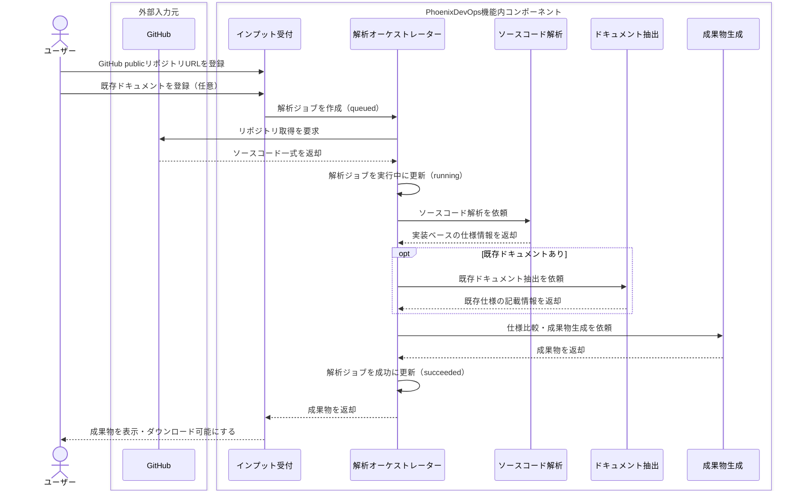

# 「ドキュメント・ドリフト」検知＆真実の設計書生成エージェント 機能仕様書

## 1. 機能概要

- 目的:
  - ドキュメントとソースコードの実態が乖離したシステムを対象に、現在の正確な仕様を明らかにする。
- 基本方針:
  - ソースコードを「正」として扱い、既存ドキュメントは補助情報として参照する。
- 主な入力:
  - GitHubのpublicリポジトリURL
  - 既存の古いドキュメント（PDF、Excel、Markdown、テキストファイル）
- 主な出力:
  - 現在の実装を反映した「真の設計書（仕様書）」
  - 既存ドキュメントとの乖離を示す「ドキュメント・ドリフトレポート」
- 利用価値:
  - 引き継ぎ直後の開発者が、仕様不明の不安を減らし、改修や改善に着手できる状態を作る。

## 2. 機能フロー

### 2.1. 登場要素の分類

| 分類 | 要素 | 役割 |
| --- | --- | --- |
| 外部アクター | ユーザー | 解析対象を登録し、生成された成果物を確認する |
| 外部入力元 | GitHub | 指定されたpublicリポジトリからソースコードを提供する |
| 機能内コンポーネント | インプット受付 | GitHubリポジトリURLと既存ドキュメントを受け付け、解析ジョブを作成する |
| 機能内コンポーネント | 解析オーケストレーター | 解析ジョブの状態管理、各解析処理、成果物生成を制御する |
| 機能内コンポーネント | ソースコード解析 | ソースコードを正として、実装ベースの仕様を抽出する |
| 機能内コンポーネント | ドキュメント抽出 | 既存ドキュメントの記載内容を抽出する |
| 機能内コンポーネント | 成果物生成 | 真の設計書とドリフトレポートを生成する |
| 成果物 | 真の設計書 / ドリフトレポート | シーケンス図上の参加者ではなく、生成結果として扱う |

### 2.2. 処理シーケンス

## 3. 主要機能（MVPスコープ含む）

本仕様書で扱うMVPの主要機能は6つです。まず一覧で全体像を示し、その後に各機能の詳細を記載します。

### 3.1. 主要機能一覧

| ID | 主要機能 | 役割 | MVPで対応すること |
| --- | --- | --- | --- |
| F-01 | インプット受付 | 解析対象と既存ドキュメントを受け付け、解析ジョブを作成する | GitHub publicリポジトリURL、既存ドキュメントアップロード |
| F-02 | ソースコード解析 | ソースコードを正として、実装ベースの仕様を抽出する | ファイル構成、設定、ルーティング、API、DB定義、依存関係、READMEの解析 |
| F-03 | ドキュメント抽出 | 既存ドキュメントの記載内容を比較可能な形にする | PDF、Excel、Markdown、テキストファイルの抽出 |
| F-04 | 真の設計書生成 | 現在の実装を反映した設計書を生成する | Markdown形式の真の設計書を生成 |
| F-05 | ドリフト検知・レポート生成 | ソースコード由来の仕様と既存ドキュメントを比較する | 4分類の差分レポートをMarkdown形式で生成 |
| F-06 | 解析ジョブ管理 | 解析処理の状態を管理し、失敗時の再実行を可能にする | `queued / running / succeeded / failed` の状態管理 |

### 3.2. F-01 インプット受付

#### 3.2.1. 入力仕様

| 入力 | 必須 | 内容 |
| --- | --- | --- |
| GitHub publicリポジトリURL | 必須 | 解析対象のソースコード取得元 |
| ブランチ | 任意 | 未指定の場合はGitHubリポジトリのデフォルトブランチを使用 |
| 既存ドキュメント | 任意 | PDF、Excel、Markdown、テキストファイルをアップロード可能 |

- 既存ドキュメントが未登録の場合は、ドリフト比較は行わず、真の設計書のみ生成します。
- インプット受付時に解析ジョブを作成し、ジョブ状態を `queued` として管理します。

#### 3.2.2. 解析対象リポジトリの前提

| 項目 | MVPでの扱い |
| --- | --- |
| 対象システム | Webアプリケーションのリポジトリを保証対象とする |
| 言語・フレームワーク | 限定しない |
| 解析根拠 | ファイル構成、設定ファイル、ルーティング、API定義、DB定義、依存関係、README |
| 解析対象外 | `node_modules`、`.git`、ビルド成果物、画像・動画などのバイナリファイル |
| 解析できない箇所 | 「判断不能」として成果物に出力する |

#### 3.2.3. MVP対象外

| 対象外項目 | 対応方針 |
| --- | --- |
| privateリポジトリ | v2以降で対応 |
| GitHub OAuth | v2以降で対応 |
| ZIPアップロード | v2以降で対応 |
| Google Drive連携 | v2以降で対応 |
| スキャン文書OCR | v2以降で対応 |
| 言語固有の深い静的解析 | MVPでは保証しない |

### 3.3. F-02 ソースコード解析

| 項目 | 仕様 |
| --- | --- |
| 正とする情報 | GitHubから取得したソースコード |
| 補助情報 | 既存ドキュメント |
| 抽出対象 | 機能、システム構成、画面・ルーティング、API、データモデル、業務ルール、依存関係、外部連携 |
| 根拠情報 | 抽出結果ごとに根拠となるファイルパスを保持 |
| 推測の扱い | 根拠を示せない内容は断定せず、「推測」として明示 |
| 矛盾の扱い | ソースコードと既存ドキュメントに矛盾がある場合は、ソースコードを正として扱う |

### 3.4. F-03 ドキュメント抽出

| 項目 | 仕様 |
| --- | --- |
| 対象形式 | PDF、Excel、Markdown、テキストファイル |
| 抽出対象 | 仕様記述、画面項目、業務ルール、制約条件 |
| 変換後の形式 | ソースコード由来の仕様と比較できるテキスト・構造化データ |
| 比較単位 | ドリフトレポートで差分として扱える単位に分割 |
| 対象外 | スキャン文書のOCR |

### 3.5. F-04 真の設計書生成

- 解析したソースコードに基づき、現在のシステムの実態を反映した「真の設計書（仕様書）」を自動生成します。
- MVPでは、真の設計書をMarkdown形式で出力します。

| 章 | 内容 |
| --- | --- |
| 1. 解析対象 | リポジトリURL、ブランチ、解析日時、解析対象ファイル、除外ファイル |
| 2. システム概要 | システムの目的、主な利用者、主要機能、推測事項 |
| 3. 技術スタック | フロントエンド、バックエンド、DB、インフラなどの推定結果と根拠 |
| 4. 主要機能一覧 | 機能名、概要、根拠コード、備考 |
| 5. 画面・ルーティング一覧 | パス、画面名、役割、根拠コード |
| 6. API一覧 | メソッド、パス、処理概要、入力、出力、根拠コード |
| 7. データモデル | モデル名、項目、型、制約、根拠コード |
| 8. 業務ルール・バリデーション | ルール、内容、根拠コード、確度 |
| 9. 外部連携 | 連携先、用途、根拠コード |
| 10. 判断不能・推測事項 | 判断できなかった項目、理由、必要な追加情報 |

### 3.6. F-05 ドリフト検知・レポート生成

- 自動生成した真の仕様と既存ドキュメントを比較し、ドキュメント・ドリフトレポートを生成します。
- MVPでは、ドキュメント・ドリフトレポートをMarkdown形式で出力します。

#### 3.6.1. 差分分類

| 分類 | 意味 |
| --- | --- |
| 実装あり・文書なし | ソースコード上には存在するが、既存ドキュメントに記載がない |
| 文書あり・実装なし | 既存ドキュメントに記載があるが、ソースコード上に確認できない |
| 内容不一致 | ソースコードと既存ドキュメントの内容が矛盾している |
| 判断不能 | 根拠不足、解析不能、または文書とコードの対応関係が特定できない |

#### 3.6.2. レポート構成

| 章 | 内容 |
| --- | --- |
| 1. サマリー | 差分分類ごとの件数 |
| 2. 差分一覧 | ID、分類、対象、内容、重要度、確度、根拠コード、根拠ドキュメント、推奨対応 |
| 3. 分類定義 | 差分分類の説明 |
| 4. 判断ルール | ソースコードを正とすること、推測を断定しないこと、根拠を明示すること |

#### 3.6.3. 判断ルール

- ドリフト判定では、ソースコードを正とし、既存ドキュメントは補足情報として扱います。
- ソースコードと既存ドキュメントに矛盾がある場合は、矛盾箇所を列挙します。
- 根拠がない推測は「推測」と明示します。
- 根拠を示せない内容は断定しません。

### 3.7. F-06 解析ジョブ管理

| 状態 | 意味 |
| --- | --- |
| queued | 解析ジョブが作成され、実行待ちの状態 |
| running | ソースコード解析、ドキュメント抽出、成果物生成のいずれかを実行している状態 |
| succeeded | 真の設計書、または真の設計書とドリフトレポートの生成が完了した状態 |
| failed | 解析または成果物生成に失敗した状態 |

- `failed` の場合は、失敗理由をユーザーに表示します。
- ユーザーは失敗したジョブを再実行できます。
- 部分的に解析できた場合は、生成可能な成果物を出力し、未解析箇所を「判断不能」として明示します。

## 4. 想定技術スタックとシステム構成

- MVPでは、ハッカソンの必須条件を満たすため、以下の技術スタックを想定します。

| 分類 | 採用技術 | 用途 |
| --- | --- | --- |
| アプリケーション実行基盤 | Cloud Run | Webアプリケーション/APIの実行 |
| AI技術 | Gemini API | ソースコード解析、ドキュメント抽出、成果物生成 |
| ファイル保管 | Cloud Storage | アップロードされた既存ドキュメント、生成成果物の保存 |
| 外部入力元 | GitHub | publicリポジトリからのソースコード取得 |

- MVPでは、ユーザーがGitHub publicリポジトリURLと既存ドキュメントを登録し、Cloud Run上のアプリケーションが解析ジョブを作成します。
- 解析処理では、GitHubから取得したソースコードとアップロードされた既存ドキュメントをGemini APIで解析します。
- 生成された真の設計書とドリフトレポートはCloud Storageに保存し、ユーザーが画面から表示・ダウンロードできるようにします。

## 5. ユーザーストーリーと体験価値

1. 依頼: システムを引き継いだ開発者が、前任者から共有された「GitHub publicリポジトリURL」と「大量の古い仕様書」をエージェントに読み込ませます。
2. 解析・比較: エージェントが自律的にソースコードをリバースエンジニアリングし、同時に古い仕様書との差分（ドリフト）を特定します。
3. 提供: 開発者は、システムの実態を正確に表した「真の設計書」と、過去のドキュメントの嘘を暴く「ドキュメント・ドリフトレポート」を受け取ります。
4. 体験価値: 開発者は「仕様がわからないから怖くて触れない」という状態から解放され、本来の開発やシステムの改善（IaC化やCI/CD構築など）に安心して集中できるようになります。
