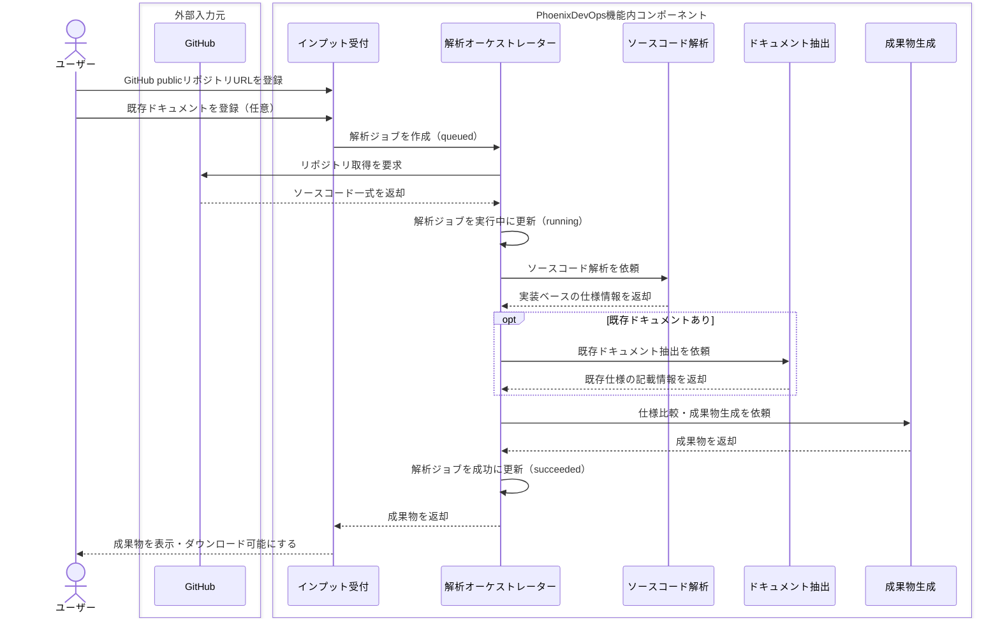
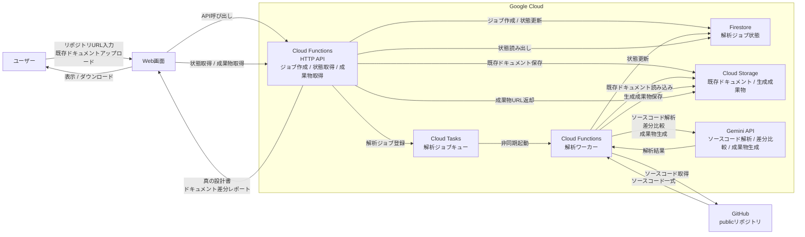

# 「ドキュメント・ドリフト」検知＆真実の設計書生成エージェント 機能仕様書

## 1. この機能で解決すること

この機能は、古いドキュメントと現在のソースコードが一致していないシステムを対象に、現行仕様を短時間で把握できる状態を作る。

基本方針は次のとおり。

- ソースコードを「正」として扱う。
- 既存ドキュメントは、比較対象および補助情報として扱う。
- 根拠を示せない内容は断定しない。
- 解析できない箇所は「判断不能」として明示する。

MVPでは、ユーザーがGitHub publicリポジトリURLと既存ドキュメントを登録すると、次の2つを生成する。

- 真の設計書: 現在の実装を反映した仕様書
- ドキュメント差分レポート: 既存ドキュメントとソースコードの差分をまとめたレポート

## 2. MVPで作る範囲

### 2.1. 対象機能

MVPでは、次の6機能を作る。

| ID | 機能 | MVPでやること |
| --- | --- | --- |
| F-01 | 解析対象登録 | GitHub publicリポジトリURL、ブランチ、既存ドキュメントを受け付ける |
| F-02 | ソースコード解析 | ファイル構成、設定、ルーティング、API、DB定義、依存関係、READMEを解析する |
| F-03 | ドキュメント抽出 | PDF、Excel、Markdown、テキストファイルから仕様記述を抽出する |
| F-04 | 真の設計書生成 | ソースコード由来の情報を正として、Markdown形式の設計書を生成する |
| F-05 | ドキュメント差分レポート生成 | 実装と既存ドキュメントの差分を4分類で整理し、Markdown形式で出力する |
| F-06 | 解析ジョブ管理 | `queued / running / succeeded / failed` の状態を管理する |

### 2.2. MVPではやらないこと

次の機能は、MVP対象外とする。

| 対象外 | 理由・対応方針 |
| --- | --- |
| privateリポジトリ解析 | GitHub OAuthが必要なため、v2以降で対応する |
| ZIPアップロード | MVPではGitHub publicリポジトリURLを優先する |
| Google Drive連携 | MVPでは通常のファイルアップロードで代替する |
| スキャン文書OCR | MVPではテキスト抽出可能な文書のみ扱う |
| 言語固有の深い静的解析 | MVPでは汎用的な構造解析に留める |
| IaC生成・STG環境構築 | 本エージェントの将来拡張として扱う |
| 仕様質問AIチャット | 生成成果物の活用機能としてv2以降で扱う |

## 3. ユーザーの流れ

1. ユーザーがGitHub publicリポジトリURLを登録する。
2. 必要に応じて、古い仕様書や設計書をアップロードする。
3. システムが解析ジョブを作成し、解析を開始する。
4. ソースコードから現行仕様を抽出する。
5. 既存ドキュメントがある場合は、記載内容を抽出する。
6. ソースコード由来の仕様を正として、真の設計書を生成する。
7. 既存ドキュメントがある場合は、ドキュメント差分レポートを生成する。
8. ユーザーが生成結果を画面で確認し、Markdownとしてダウンロードする。

## 4. 入力仕様

| 入力 | 必須 | 内容 |
| --- | --- | --- |
| GitHub publicリポジトリURL | 必須 | 解析対象のソースコード取得元 |
| ブランチ | 任意 | 未指定の場合はリポジトリのデフォルトブランチを使用する |
| 既存ドキュメント | 任意 | PDF、Excel、Markdown、テキストファイルをアップロードできる |

既存ドキュメントが未登録の場合は、差分比較は行わず、真の設計書のみ生成する。

## 5. 解析対象

| 項目 | MVPでの扱い |
| --- | --- |
| 対象システム | Webアプリケーションのリポジトリを主な対象とする |
| 言語・フレームワーク | 限定しない。ただし言語固有の深い静的解析は保証しない |
| 解析根拠 | ファイル構成、設定ファイル、ルーティング、API定義、DB定義、依存関係、README |
| 解析対象外 | `node_modules`、`.git`、ビルド成果物、画像・動画などのバイナリファイル |
| 解析できない箇所 | 「判断不能」として成果物に出力する |

## 6. 出力仕様

### 6.1. 真の設計書

ソースコードを正として、現在のシステムの実態を反映した設計書を生成する。

| 章 | 内容 |
| --- | --- |
| 1. 解析対象 | リポジトリURL、ブランチ、解析日時、解析対象ファイル、除外ファイル |
| 2. システム概要 | システムの目的、主な利用者、主要機能、推測事項 |
| 3. 技術スタック | フロントエンド、バックエンド、DB、インフラなどの推定結果と根拠 |
| 4. 主要機能一覧 | 機能名、概要、根拠コード、備考 |
| 5. 画面・ルーティング一覧 | パス、画面名、役割、根拠コード |
| 6. API一覧 | メソッド、パス、処理概要、入力、出力、根拠コード |
| 7. データモデル | モデル名、項目、型、制約、根拠コード |
| 8. 業務ルール・バリデーション | ルール、内容、根拠コード、確度 |
| 9. 外部連携 | 連携先、用途、根拠コード |
| 10. 判断不能・推測事項 | 判断できなかった項目、理由、必要な追加情報 |

### 6.2. ドキュメント差分レポート

ソースコード由来の仕様と既存ドキュメントを比較し、差分をレポート化する。

#### 差分分類

| 分類 | 意味 |
| --- | --- |
| 実装あり・文書なし | ソースコード上には存在するが、既存ドキュメントに記載がない |
| 文書あり・実装なし | 既存ドキュメントに記載があるが、ソースコード上に確認できない |
| 内容不一致 | ソースコードと既存ドキュメントの内容が矛盾している |
| 判断不能 | 根拠不足、解析不能、または文書とコードの対応関係が特定できない |

#### レポート構成

| 章 | 内容 |
| --- | --- |
| 1. サマリー | 差分分類ごとの件数 |
| 2. 差分一覧 | ID、分類、対象、内容、重要度、確度、根拠コード、根拠ドキュメント、推奨対応 |
| 3. 分類定義 | 差分分類の説明 |
| 4. 判断ルール | ソースコードを正とすること、推測を断定しないこと、根拠を明示すること |

## 7. 判断ルール

- 差分判定では、ソースコードを正とし、既存ドキュメントは補助情報として扱う。
- ソースコードと既存ドキュメントに矛盾がある場合は、矛盾箇所を列挙する。
- 根拠がない推測は「推測」と明示する。
- 根拠を示せない内容は断定しない。
- 部分的に解析できた場合は、生成可能な成果物を出力し、未解析箇所を「判断不能」として明示する。

## 8. 解析ジョブ管理

| 状態 | 意味 |
| --- | --- |
| queued | 解析ジョブが作成され、実行待ちの状態 |
| running | ソースコード解析、ドキュメント抽出、成果物生成のいずれかを実行している状態 |
| succeeded | 真の設計書、または真の設計書とドキュメント差分レポートの生成が完了した状態 |
| failed | 解析または成果物生成に失敗した状態 |

`failed` の場合は、失敗理由をユーザーに表示する。ユーザーは失敗したジョブを再実行できる。

## 9. 処理構成

### 9.1. 登場要素

| 分類 | 要素 | 役割 |
| --- | --- | --- |
| 外部アクター | ユーザー | 解析対象を登録し、生成された成果物を確認する |
| 外部入力元 | GitHub | 指定されたpublicリポジトリからソースコードを提供する |
| 機能内コンポーネント | インプット受付 | GitHubリポジトリURLと既存ドキュメントを受け付け、解析ジョブを作成する |
| 機能内コンポーネント | 解析オーケストレーター | 解析ジョブの状態管理、各解析処理、成果物生成を制御する |
| 機能内コンポーネント | ソースコード解析 | ソースコードを正として、実装ベースの仕様を抽出する |
| 機能内コンポーネント | ドキュメント抽出 | 既存ドキュメントの記載内容を抽出する |
| 機能内コンポーネント | 成果物生成 | 真の設計書とドキュメント差分レポートを生成する |

### 9.2. 処理シーケンス

## 10. システム構成図

### 10.1. 想定技術スタック

| 分類 | 採用技術 | 用途 |
| --- | --- | --- |
| API実行基盤 | Cloud Functions | 解析ジョブ作成、状態取得、成果物取得APIの実行 |
| 非同期実行 | Cloud Tasks | 解析ジョブのキューイング、解析ワーカーの起動、リトライ制御 |
| ジョブ状態管理 | Firestore | `queued / running / succeeded / failed` の保存 |
| AI技術 | Gemini API | ソースコード解析、ドキュメント抽出、成果物生成 |
| ファイル保管 | Cloud Storage | アップロードされた既存ドキュメント、生成成果物の保存 |
| 外部入力元 | GitHub | publicリポジトリからのソースコード取得 |

### 10.2. 採用背景

| 採用技術 | 採用理由 | 代替案と見送り理由 |
| --- | --- | --- |
| Cloud Functions | Web画面を別に用意し、バックエンドをAPIとして呼び出す前提のため。解析ジョブ作成、状態取得、成果物取得を小さなHTTP APIとして分けやすい。 | Cloud Runも選択肢だが、MVPではWebアプリ本体を載せる前提ではないため採用優先度を下げる。 |
| Cloud Tasks | ユーザー操作で作成された解析ジョブをキューに積み、解析ワーカーへ確実に渡したい。リトライ、実行量制御、HTTPワーカー起動を扱いやすい。 | Pub/Subはイベント配信や複数購読者への通知に向くが、今回の主目的はジョブキューのためCloud Tasksを優先する。 |
| Firestore | `queued / running / succeeded / failed` などのジョブ状態をAPIから読み書きしやすい。画面側から状態取得APIを呼ぶ構成と相性がよい。 | Cloud Storageに状態ファイルを置く方法も可能だが、状態更新や検索が増えると扱いづらい。 |
| Cloud Storage | アップロードされた既存ドキュメントと、生成された真の設計書・ドキュメント差分レポートを保管する用途に合う。 | Firestoreに成果物本文を保存する方法もあるが、ファイル成果物の保存先としてはCloud Storageの方が自然。 |
| Gemini API | ハッカソン指定のGoogle AI技術群の中で、MVPの中心処理であるソースコード解析、既存ドキュメント抽出、仕様比較、Markdown成果物生成に最も直接使いやすい。 | Gemini Enterprise、Agent Builder、ADKなども選択肢だが、MVPではまず単一のAPIからAI処理を呼び出す方が構成をシンプルにできるため、Gemini APIを採用する。 |
