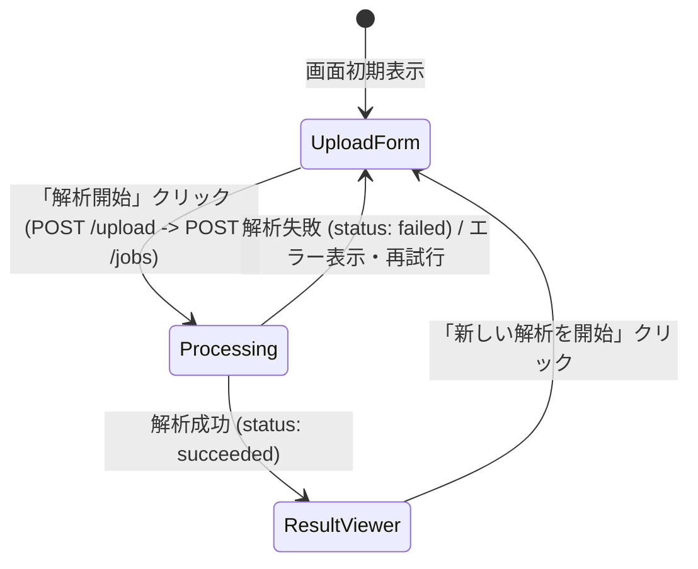

# [Drift Agent] UI/フロントエンド (MVP用簡易画面) 機能仕様書

## 1. この機能で解決すること

この機能は、「ドキュメント・ドリフト検知＆真実の設計書生成エージェント」を非エンジニアや運用担当者でも簡単かつ直感的に利用できるようにするためのWeb UI（MVP用簡易画面）を提供する。

古い設計ドキュメントと現在のソースコードが乖離しているシステムにおいて、ユーザーが手元のファイルをアップロードするだけで、解析の進行状況を把握し、生成された最新仕様（真の設計書）と差分レポートを美しくプレビュー・ダウンロードできる状態を作る。

---

## 2. MVPで作る範囲

### 2.1. 対象機能

MVPでは、ユーザーが迷わず1本のシナリオを完遂できるシンプルな単一画面（SPA）として、次の4機能を提供する。

| ID | 機能 | 仕様詳細 |
| --- | --- | --- |
| **UI-01** | アップロードフォーム | プロジェクト名の入力、ソースコードZIP、既存ドキュメント（複数）のアップロードを受け付け、バリデーションを行う。 |
| **UI-02** | ジョブ進捗表示 | ジョブID発番後、解析ステータス（`queued` / `running`）をポーリングし、アニメーションとステータス表示で進行状況を可視化する。 |
| **UI-03** | 結果表示（プレビュー） | 解析成功（`succeeded`）時に返されるMarkdownファイル（真の設計書、差分レポート）をパースし、Web画面上で美しくプレビュー表示する。 |
| **UI-04** | 成果物ダウンロード | プレビュー中の各Markdownファイルを、ローカルファイル（`.md`）として即座にダウンロードできる。 |

### 2.2. MVPではやらないこと

以下の機能は、画面の複雑化を防ぐためMVP対象外とし、v2以降で検討する。

| 対象外機能 | 理由・対応方針 |
| --- | --- |
| ユーザー管理・認証 | MVPでは認証なしのパブリック（またはローカル限定）ツールとして動作させる。 |
| 解析履歴一覧 | 過去の解析ジョブ一覧や再ダウンロードは行わず、ブラウザセッション内での単発実行とする。 |
| オンライン編集 | 生成されたMarkdownを画面上で直接編集・保存する機能は持たせず、ローカルにダウンロードして編集してもらう。 |
| Gitリポジトリ直接連携 | Webブラウザへのファイルアップロード（ZIP）のみに絞り、GitHub等のアカウント連携は行わない。 |

---

## 3. 画面設計とユーザーの流れ

単一のWebページが状態（State）に応じて、以下の3つの表示モードに切り替わる構成とする。



### 3.1. 表示モード詳細

#### ① アップロードフォーム画面（`UploadForm`）
* **プロジェクト名入力欄**:
  * 任意入力のテキストボックス（例: `Legacy SaaS Project`）。
* **ソースコードZIPアップロードエリア**:
  * ドラッグ＆ドロップまたはファイルブラウザから選択。
  * `.zip` 形式のファイルのみを制限。必須入力。
* **既存ドキュメントアップロードエリア**:
  * ドラッグ＆ドロップまたはファイルブラウザから選択。
  * 複数ファイルの同時選択に対応（PDF、Excel、Word、PowerPoint等を想定）。
  * 必須入力。
* **解析開始ボタン**:
  * 必要な入力がすべて揃うまで非活性（Disabled）状態。
  * クリック時、ローディング状態に入り、裏側でAPIリクエストを実行する。

#### ② 解析ジョブ進捗画面（`Processing`）
* **進行状況インジケーター**:
  * 円形のローディングスピナー、または進捗バー。
  * 現在のステータス（`queued`: 解析待ち / `running`: 解析中）を表示。
* **経過時間カウンター**:
  * ジョブ開始からの経過時間を秒単位で表示し、フリーズしていないことをユーザーに伝える。
* **エラーハンドリング**:
  * ジョブが `failed` になった場合、進行画面内にエラーメッセージと原因を表示する。
  * 「フォームに戻る」ボタンを提供し、ファイルの修正や再試行を可能にする。

#### ③ 結果表示・ダウンロード画面（`ResultViewer`）
* **タブ切り替えスイッチ**:
  * 「真の設計書 (`true-design.md`)」と「ドキュメント差分レポート (`document-drift-report.md`)」の2枚のタブ。
* **Markdownプレビューエリア**:
  * MarkdownをHTMLに変換し、スタイルを適用して表示する。
  * テーブル（表）は線や背景色を整え、コードブロックはシンタックスハイライト風の等幅フォントスタイルを適用する。
* **ダウンロードボタン**:
  * 「設計書をダウンロード」「レポートをダウンロード」の2つのボタン。
  * 押下すると、ブラウザ経由でローカルに `.md` ファイルを即時保存する。
* **「新しい解析を開始する」ボタン**:
  * クリックするとすべての状態をリセットし、①のアップロードフォーム画面に戻る。

---

## 4. API連携仕様

UIはバックエンドAPI（Cloud Functions）と以下の仕様で連携する。

### 4.1. ファイルアップロードとジョブ起動
ユーザーが「解析開始」ボタンを押した際、UIは以下の2段階のリクエストを順に実行する。

1. **アップロード処理**:
   * **エンドポイント**: `POST /upload`
   * **データ形式**: `multipart/form-data`
   * **送信パラメータ**:
     * `sourceArchive`: ソースコードZIPファイル
     * `documents`: 既存ドキュメントファイル群（複数）
     * `projectName`: プロジェクト名（任意）
   * **レスポンス (201 Created)**:
     ```json
     {
       "uploadId": "upload-123",
       "sourceArchiveUri": "gs://...",
       "documentUris": ["gs://..."],
       "projectName": "Legacy SaaS"
     }
     ```

2. **ジョブ作成処理**:
   * **エンドポイント**: `POST /jobs`
   * **データ形式**: `application/json`
   * **送信パラメータ**:
     ```json
     {
       "uploadId": "upload-123"
     }
     ```
   * **レスポンス (201 Created)**:
     ```json
     {
       "jobId": "job-123",
       "status": "queued",
       "sourceArchiveUri": "gs://...",
       "documentUris": ["gs://..."],
       "resultsPrefix": "results/job-123",
       "uploadId": "upload-123",
       "projectName": "Legacy SaaS"
     }
     ```

### 4.2. 進捗状況のポーリング
ジョブ起動完了後、UIは `jobId` を使ってポーリングを行う。

* **エンドポイント**: `GET /jobs/{jobId}`
* **ポーリング間隔**: 3〜5秒（バックエンドの負荷とレスポンス性を考慮）
* **終了条件**: `status` が `succeeded` または `failed` になるまで。
* **レスポンス (200 OK - running時)**:
  ```json
  {
    "jobId": "job-123",
    "status": "running"
  }
  ```
* **レスポンス (200 OK - succeeded時)**:
  ```json
  {
    "jobId": "job-123",
    "status": "succeeded",
    "artifactPaths": {
      "true-design.md": "gs://...",
      "document-drift-report.md": "gs://..."
    }
  }
  ```
* **レスポンス (200 OK - failed時)**:
  ```json
  {
    "jobId": "job-123",
    "status": "failed",
    "errorMessage": "解析エンジンの実行中にタイムアウトが発生しました。"
  }
  ```

### 4.3. 成果物URLの取得とプレビュー表示
ジョブが `succeeded` になった後、UIは署名付きURLを取得してコンテンツを読み込む。

* **エンドポイント**: `GET /jobs/{jobId}/results`
* **レスポンス (200 OK)**:
  ```json
  {
    "jobId": "job-123",
    "status": "succeeded",
    "expiresIn": 3600,
    "artifacts": [
      {
        "name": "true-design.md",
        "uri": "gs://...",
        "url": "https://storage.googleapis.com/... (signed URL)"
      },
      {
        "name": "document-drift-report.md",
        "uri": "gs://...",
        "url": "https://storage.googleapis.com/... (signed URL)"
      }
    ]
  }
  ```
* **コンテンツ描画処理**:
  * UIは返却された各 `url`（署名付きURL）に対してブラウザから `fetch` を実行し、Markdownの生テキストデータを取得する。
  * 取得した生テキストを画面上のMarkdownプレビュー領域に渡し、HTMLとしてレンダリングする。
  * ダウンロード時は、この `url` を `<a>` タグの `href` に設定し、`download` 属性を指定してダウンロードさせる。
  * 成果物保存先のCloud Storageバケットは、署名付きURLのMarkdownプレビュー用に `GET` / `HEAD` のCORSを許可する。

### 4.4. デプロイ環境の設定

* Web UIはTerraform管理のCloud Functions Gen2としてホスティングする。
* デプロイ環境のAPI URLは、Viteのbuild-time `.env` ではなく、TerraformがWeb UI関数の環境変数として渡す。
* Web UI関数は `/config.js` を動的生成し、`window.__PHOENIX_CONFIG__.API_URL` としてHTTP APIのURLを公開する。UIはこれを優先して参照する。
* GCS bucket の Public Access Prevention が enforced の環境でも公開できるよう、静的ファイルの公開は GCS bucket IAM ではなく Cloud Functions / Cloud Run invoker IAM で制御する。

---

## 5. 想定技術スタック

簡易画面（MVP）でありながら、高いユーザビリティとリッチなビジュアル表現を実現するため、以下の構成を提案する。

### 5.1. 候補スタックの比較

| 項目 | 【案A（推奨）】Vite + React (TS) + Vanilla CSS | 【案B】Vanilla HTML + Vanilla CSS + JS |
| --- | --- | --- |
| **開発効率** | **◎ 非常に高い**<br/>Markdownパースや状態管理の外部ライブラリが豊富で、安全に型定義（TypeScript）を使用可能。 | **△ やや低い**<br/>DOM操作や状態ポーリング、Markdownパースをすべてスクラッチで書く必要があり、コードが肥大化しやすい。 |
| **デザイン表現** | **◎ 非常に高い**<br/>コンポーネント単位のクリーンなCSS設計、および `lucide-react` 等の高品質なアイコン利用が容易。 | **◯ 高い**<br/>標準的なCSSで実装。ただし、動的なUIアニメーションや状態遷移の管理が複雑になる。 |
| **Markdown表示** | **◎ 容易**<br/>`react-markdown`, `remark-gfm` 等を使用し、テーブル構造を含むMarkdownを数行で完全描画。 | **△ 面倒**<br/>`marked.js` 等の外部スクリプトタグを読み込み、セキュリティ（サニタイズ）を自前で担保する必要がある。 |
| **ビルド環境** | **◯ 必要**<br/>Viteによる高速なホットリロードとビルドが必要。 | **◎ 不要**<br/>HTML/CSS/JSファイルを配置するだけで、Webサーバーがあれば即動作する。 |

**【結論】**
拡張性、Markdown描画の正確性、そしてUIの状態管理（ファイルアップロード中のプログレス表示、進捗のポーリング状態、タブ切り替え）の堅牢性を考慮し、**「案A: Vite + React + TypeScript + Vanilla CSS」**を推奨する。

---

## 6. デザイン・意匠の方針 (Aesthetics)

「退職した前任者の負の遺産から、システムを再生する」というプロダクトコンセプト「Phoenix（不死鳥）」に基づき、暗闇から復活する炎を想起させるような**宇宙的なダークテーマ**をベースとする。

* **カラーパレット**:
  * バックグラウンド: 深い宇宙を想起させるダークネイビー〜ブラックの微細なグラデーション (`#090d16` から `#0f172a`)
  * アクセントカラー: 不死鳥の炎をイメージした鮮やかなグラデーション（オレンジ・ピンク・パープル）
  * テキスト: クリーンで可読性の高いオフホワイト (`#f8fafc`) と、補助情報のライトグレー (`#94a3b8`)
* **ガラスモーフィズム (Glassmorphism)**:
  * カード要素やアップロードエリアに半透明の背景 (`rgba(30, 41, 59, 0.5)`) と微弱な境界ぼかし (`backdrop-filter: blur(12px)`)、細い1pxの光るボーダーを適用し、未来感のある高級感を演出する。
* **インタラクティブアニメーション**:
  * ファイルのドラッグ＆ドロップ領域にホバーした際の、ボーダーの波打つアニメーションや発光エフェクト。
  * 進捗ポーリング時のスムーズなローディングスケルトンと、ステータス変更時のフェードイン効果。
  * ボタン押下時の微小な縮小エフェクト（クリックフィードバック）。
* **タイポグラフィ**:
  * Google Fonts からモダンなサンセリフフォントである `Outfit` および `Inter` をインポートし、デフォルトブラウザフォントを排除。英数字と日本語が調和した美しいプロポーショナル表示を行う。
